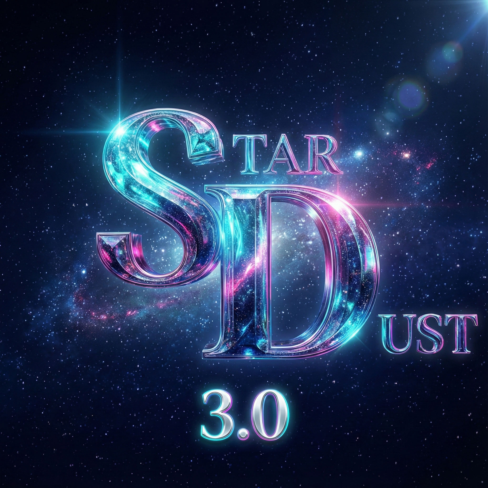

# Stardust 3.0

Stardust is a Rocket League bot for [RLBot](http://www.rlbot.org/) v5, written in C# on RedUtils.

Stardust 3.0 combines:
- **A tactical decision layer:** threat-first defence, possession play (ground catches, hood carries, pressure flicks, aerial carries), shadowing, and team claims.
- **Scripted mechanics:** speed-flip kickoffs, shots, dodges, half flips, wavedashes, and recovery.
- **A physics core:** every model is validated against [RocketSim](https://github.com/ZealanL/RocketSim). It covers driving and navigation, jumps, dodges, flips, air control, aerials, car–ball impacts, and a strike planner.

The repository includes the evaluation harness used to decide what ships. It is a RocketSim match simulator that speaks the RLBot v5 protocol, with paired match series, scenario fixtures, and physics-model checks.

See **[docs/STARDUST_3.md](docs/STARDUST_3.md)** for:
- the architecture;
- the physics models and their measured accuracy;
- how to run the simulator;
- the match results behind each change, including what was tried and rejected;
- build and test commands and runtime switches.

## History

Stardust 2.0 was optimized for 2v2 and 3v3 and was redeveloped for the RLBot Championship finals. It finished fourth in the **RLBot Championship 2023**; the finals video is [here](https://www.youtube.com/watch?v=6A8_6RR4vR0&t=305s).
